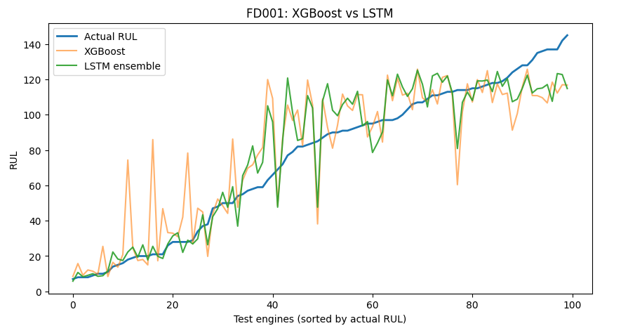

# Predictive Maintenance: Turbofan Engine RUL Prediction

Predicting the **Remaining Useful Life (RUL)** of turbofan engines from multivariate sensor data (NASA C-MAPSS, FD001) using an LSTM, compared against classical ML baselines.

**Kaggle notebook:** (https://www.kaggle.com/code/ashokchoudhary212422/predictive-maintenance-turbofan-rul-with-ml)

## Why it matters
Unplanned engine failure is costly and unsafe. Predicting how many cycles an engine has left allows maintenance to occur *before* failure, without retiring engines too early.

## Approach
- **Data:** NASA C-MAPSS FD001 (100 train / 100 test engines, 14 informative sensors after removing constant and weak columns).
- **Preprocessing:** RUL capped at 125 for training, min-max scaling (fit on train only), engine-wise validation split to avoid leakage.
- **Baselines:** Linear Regression, Random Forest, XGBoost (single-cycle features + 10-cycle rolling means).
- **Model:** 2-layer LSTM on 30-cycle sliding windows (PyTorch), best epoch chosen on validation RMSE.
- **Evaluation:** last cycle of each test engine, using RMSE and the NASA asymmetric score (penalizes late predictions more). Reported over 5 random seeds.

## Results
| Model | RMSE (raw) | RMSE (capped) | NASA score (capped) |
|---|---|---|---|
| Linear Regression | 21.80 | 20.81 | 1523.9 |
| Random Forest | 21.08 | 20.12 | 1935.4 |
| XGBoost | 20.11 | 19.15 | 1844.6 |
| **LSTM (mean of 5 seeds)** | **15.02 ± 0.18** | **13.91 ± 0.23** | **~393** |
| LSTM ensemble (5 seeds) | 14.87 | 13.74 | 381.7 |
   
The LSTM reduces RMSE by about 25% and the NASA score by about 79% compared to XGBoost, with the largest gains near failure (RUL below about 35 cycles), where maintenance decisions matter most.

## Limitations
- Some mid-range engines (true RUL about 40 to 80) show sudden drops in predicted RUL.
- RUL above 125 is underestimated by design (capping).
- Only FD001 evaluated; no systematic hyperparameter search; validation uses only 20 engines.

## Future work
1D-CNN / CNN-LSTM and longer windows, a physics-informed monotonic constraint, FD002 to FD004, and a small dashboard.

## Run it
Open the notebook on Kaggle or Colab with internet enabled (data is loaded from Hugging Face: `SoyVitou/NASA-C-MAPSS-Turbofan-Engine`).

## Reference
A. Saxena et al., "Damage Propagation Modeling for Aircraft Engine Run-to-Failure Simulation," PHM 2008.

**Author:** Ashok Choudhary, MS (Research), Applied Mechanics, IIT Madras
